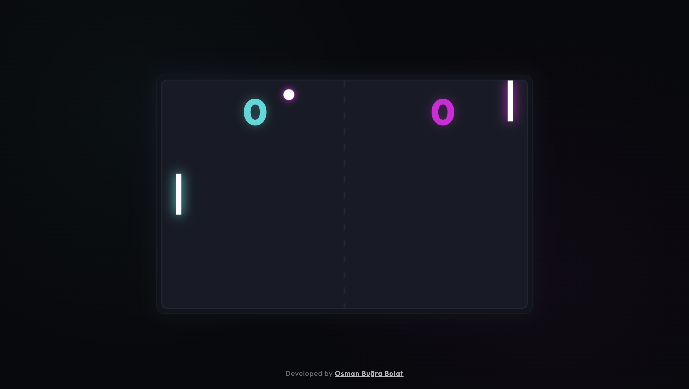

# Neon Pong AI: Hand-Tracking Web Game

**Canlı Demo:** [Buraya tıklayarak oyunu hemen tarayıcınızda oynayabilirsiniz!](https://osmanbugrabolat.github.io/pong-with-mediapipe/)

**Neon Pong AI**, Google's Mediapipe el takibi teknolojisini kullanan, fütüristik neon tasarıma sahip modern bir web tabanlı Pong oyunudur. Oyunu klavye veya fare ile değil, doğrudan **el hareketlerinizle** web kamerası üzerinden oynarsınız!



## Özellikler

- **Yapay Zeka Destekli El Takibi:** Google Mediapipe sayesinde avuç içiniz anlık olarak tespit edilir ve raketiniz elinizle senkronize hareket eder.
- **Kamera Mini-Ekranı:** Oyun başladıktan sonra ekranın sağ alt köşesinde beliren kamera penceresi ile kendi hareketlerinizi ve tespit edilen el noktalarını anlık olarak takip edebilirsiniz.
- **Retro Ses Efektleri:** Web Audio API kullanılarak üretilen çarpma ve skor sesleriyle nostaljik atari deneyimini yaşayın. İstenirse menü üzerinden sesler tamamen kapatılabilir.
- **Takım Seçimi & Akıllı Yönlendirme:** Başlangıçta oynamak istediğiniz takımı (Sol/Sağ) seçebilirsiniz. Seçiminize göre kamera ayna etkisini hesaba katarak doğru elinizi algılar. AI rakip ise otomatik olarak karşı tarafa geçer.
- **Neon / Cyberpunk Tasarım:** Tamamen Vanilla CSS ile tasarlanmış cam efektli, karanlık temalı ve yüksek kaliteli parlamalara sahip interaktif oyun menüsü.
- **Akıllı Rakip:** Topu takip eden ancak insanımsı bir hata payı barındıran bir yapay zeka. Ralliler uzadıkça heyecan artar, top hızlanır!
- **Tam Kontrol:** Oyun başlamadan önce menü üzerinden topun başlangıç hızını ayarlayabilirsiniz.

## Kullanılan Teknolojiler

- **HTML5 & CSS3:** Modern, duyarlı ve şık arayüz tasarımı.
- **Vanilla JavaScript (ES6+):** Oyun döngüsü, çarpışma fizikleri ve uygulama mantığı.
- **Web Audio API:** Performans dostu, dosya indirme gerektirmeyen tarayıcı tabanlı retro ses sentezleme.
- **HTML5 Canvas:** Kesintisiz oyun çizimi, animasyonlar ve neon parlama efektleri.
- **[Google Mediapipe](https://developers.google.com/mediapipe):** Kamera üzerinden anlık görüntü işleme ve iskelet tabanlı el takibi (Hand Tracking modeli).

## Nasıl Çalıştırılır?

Modern web tarayıcıları, güvenlik politikaları (CORS & Secure Context) gereği web kamerasına erişim için yerel bir sunucu bağlantısı gerektirir. Bu yüzden HTML dosyasına çift tıklamak yerine yerel sunucu kullanmalısınız.

1. Bilgisayarınızda [Node.js](https://nodejs.org/)'in kurulu olduğundan emin olun.
2. Projeyi bilgisayarınıza klonlayın:
   ```bash
   git clone https://github.com/osmanbugrabolat/pong-with-mediapipe.git
   ```
3. Klonlanan klasörün içine girin:
   ```bash
   cd pong-with-mediapipe
   ```
4. Yerel sunucuyu başlatmak için şu komutu çalıştırın:
   ```bash
   npx serve
   ```
5. Terminalde size verilen adresi (genellikle `http://localhost:3000`) tarayıcınızda açın.
6. Tarayıcınızın sağ üst veya sol üst kısmında belirecek olan **Kamera İzni**ni onaylayın.
7. Hızınızı, takımınızı seçin ve **OYUNA BAŞLA**'ya tıklayın!

## Oynanış İpuçları

- Kameranın elinizi (özellikle avuç içinizi) net görebileceği ve ortam ışığının iyi olduğu bir mesafede durun.
- Seçtiğiniz takıma uygun olan elinizi kameraya doğru tutun (Örn: Sol takım için sol eliniz).
- Elinizi yukarı-aşağı hareket ettirerek raketi kontrol edin.

---

**Geliştirici:** [Osman Buğra Bolat](https://osmanbugrabolat.com.tr)
